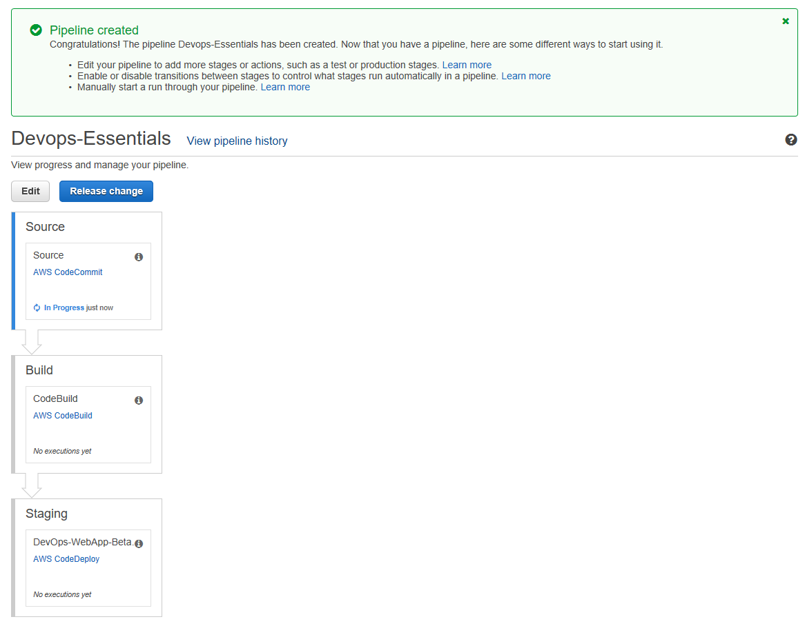
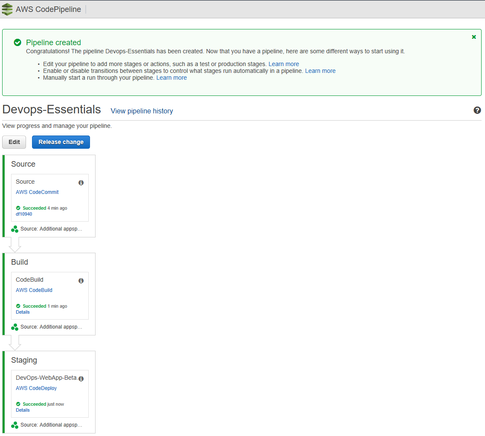
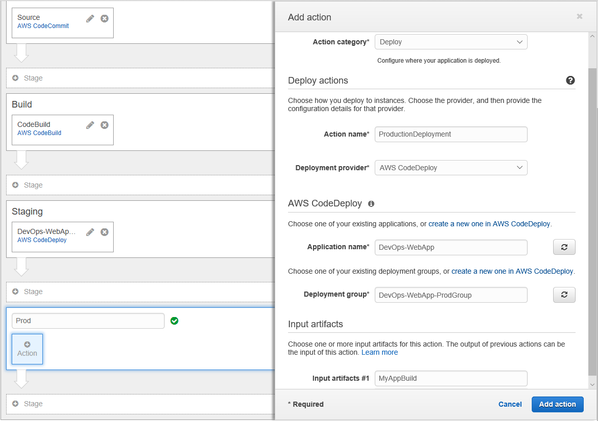
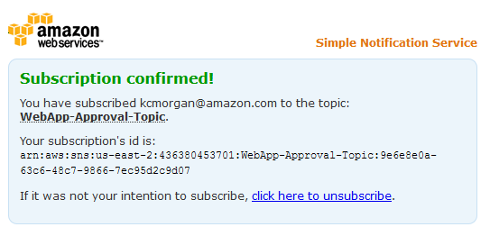
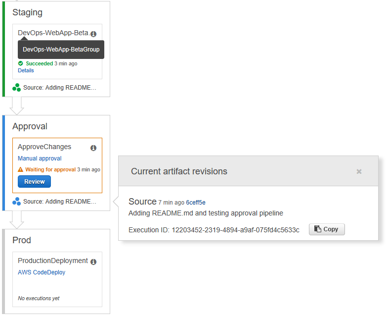
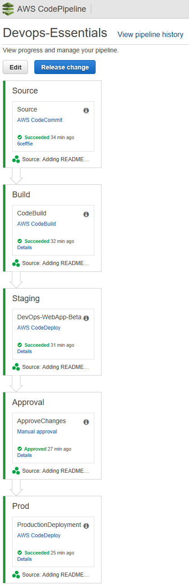

## Lab 3 - Setup CI/CD using AWS CodePipeline

### Stage 1: Create a Pipeline (Console)

To create a pipeline in the console, you'll need to provide the source file location and information about the providers you will use for your actions.

When you use the pipeline wizard, AWS CodePipeline creates the names of stages (Source, Build, Staging). These names cannot be changed. However, you can delete Build and Staging if you prefer to alter the names. You can give more specific names (for example, BuildToGamma or DeployToProd) to stages you add later.

Also, existing pipeline configuration can be exported and used to create pipeline in another region.

1. Sign in to the **AWS Management Console** and open the **AWS CodePipeline** console at [http://console.aws.amazon.com/codepipeline](http://console.aws.amazon.com/codepipeline).
2. On the **Welcome** page, choose **Create pipeline**.

If this is your first time using AWS CodePipeline, an introductory page appears instead of **Welcome**. Choose **Get Started Now**.

3. On the **Step 1: Name** page, in the **Pipeline name** box, type the name for your pipeline, and then choose **Next step**.

Within a single AWS account, each pipeline you create in a region must have a unique name. Names can be reused for pipelines in different regions.

**_Note_**
After you create a pipeline, you cannot change its name. For information about other limitations, see [Limits in AWS CodePipeline](https://docs.aws.amazon.com/codepipeline/latest/userguide/limits.html).

4. On the **Step 2: Source** page, in the **Source provider** drop-down list, choose the type of repository where your source code is stored and specify its required options:
  - **AWS CodeCommit**: In **Repository name**, choose the name of the AWS CodeCommit repository you created in Lab 1 to use as the source location for your pipeline. In Branch name, from the drop-down list, choose the branch you want to use.
  - After you choose the AWS CodeCommit repository name and branch, a message is displayed in **Change Detection Mode** showing the Amazon CloudWatch Events rule that will be created for this pipeline. Leave default selection. Choose **Next step**.

5. On the **Step 3: Build** page, do the following, and then choose **Next step:**
  - Choose **AWS CodeBuild**, and then **Select** an **existing build project** we created in Lab 1.
  - Then choose **Next step**.

6. On the **Step 4: Deploy** page, do the following, and then choose Next step:
  - Choose the following default providers from the Deployment provider drop-down list:
    + **AWS CodeDeploy:** Type or choose the name of an existing AWS CodeDeploy application in Application name and the name of a deployment group for that application in Deployment group **created in Lab2** and then choose **Next step**.

7. On the **Step 5: Service Role** page, do the following, and then choose **Next step**:
  - In the **Service Role**, drop-down list, choose an IAM service role we **create in Lab 1** for AWS CodePipeline.

8. On the **Step 6: Review** page, review your pipeline configuration, and then choose **Create pipeline** to create the pipeline.

Image below shows successfully created pipeline.


9. Now that you've created your pipeline, you can view it in the console. Pipeline will start automatically in few minutes. Otherwise, test it by manually clicking the **Release** button.

Image below shows successfully executed pipeline.


***

### Stage 2: Create CodeDeploy Deployment group for Production

1. Run the following to create a deployment group and associates it with the specified application and the user's AWS account. You need to replace the service role ARN we created using roles stack.

```console
user:~/environment $ aws deploy create-deployment-group --application-name DevOps-WebApp  \
--deployment-config-name CodeDeployDefault.OneAtATime \
--deployment-group-name DevOps-WebApp-ProdGroup \
--ec2-tag-filters Key=Name,Value=ProdWebApp01,Type=KEY_AND_VALUE \
--service-role-arn <<REPLACE-WITH-YOUR-CODEDEPLOY-ROLE-ARN>>
```

**_Note:_** We are using the different group name and Production tag to attach instance to the deployment group.

***

### Stage 3: Edit a Pipeline (Console)

You can use the AWS CodePipeline console to add, edit, or remove stages in a pipeline, as well as to add, edit, or remove actions in a stage.

We will edit the pipeline to add the stage for production deployment and introduce manual gating for production deployment.

1. On the pipeline details page, choose **Edit**. This opens the editing page for the pipeline.
2. To add a stage, choose **+ Stage** after the existing **Staging** Stage.
3. Provide a name for the stage as **Prod**, and then add an one action to it. Items marked with an asterisk are required.
4. The Add action panel opens. In Action category, choose the category as **Deploy**.
5. In **Deploy Action** section: provide name as **ProductionDeployment** and deployment provider as **AWS CodeDeploy**
6. In **AWS CodeDeploy:** Type or choose the name of an existing AWS CodeDeploy application in Application name and the name the **production deployment group** created previous stage
7. In **Input artifacts**: select the **MyAppBuild**
8. Choose **Add Action**.
9. Finally, save changes by clicking **Save pipeline changes** button.


***

### Stage 4: Add Manual approval action

In AWS CodePipeline, you can add an approval action to a stage in a pipeline at the point where you want the pipeline execution to stop so that someone with the required AWS Identity and Access Management permissions can approve or reject the action.

If the action is approved, the pipeline execution resumes. If the action is rejected—or if no one approves or rejects the action within seven days of the pipeline reaching the action and stopping—the result is the same as an action failing, and the pipeline execution does not continue.

1. **Create SNS topic** for Approval notification. And note the **topic ARN** from the result.

```console
user:~/environment $ aws sns create-topic --name WebApp-Approval-Topic
```

2. **Subscribe** to the topic using your email id. **Replace** the **ARN** and **email id** placeholders accordingly.

```console
user:~/environment $ aws sns subscribe --topic-arn <<YOUR-TOPIC-ARN>> \
--protocol email \
--notification-endpoint <<YOUR-EMAIL-ID>>
```

3. An Email would be sent for **confirmation** on the subscription. **Acknowledge** the subscription to receive mails from topic.



4. Choose **+ Stage** at the point in the pipeline **between Staging** and **Prod** stage, and type a name for the stage.
5. Choose the **+ action icon**.
6. On the **Add action** page, do the following:
7. In **Action category**, choose **Approval**.
8. In **Action name**, type a name to identify the action.
9. In **Approval type**, choose **Manual approval**.
10. In **SNS topic ARN**, choose the name of the topic created to send notifications for the approval action.
11. (Optional) In **Comments**, type any additional information you want to share with the reviewer.
12. Choose **Add action**.
13. To test your action, choose **Release change** to process that commit through the pipeline, commit a change to the source specified in the source stage of the pipeline.

***

### Stage 5: Approve or Reject an Approval Action in AWS CodePipeline

If you receive a notification that includes a direct link to an approval action, choose the **Approve or reject** link, sign in to the console if necessary, and then continue with step 7 below. Otherwise, use all the following steps.

1. Open the **AWS CodePipeline console** at https://console.aws.amazon.com/codepipeline/.
2. On the **All Pipelines** page, choose the name of the pipeline.
3. _Locate_ the stage with the approval action.
4. Hover over the information icon to view the comments and URL, if any. The information pop-up message will also display the URL of content for you to review, if one was included.
5. If a URL was provided, choose the **Manual approval** link in the action to open the target Web page, and then review the content.
6. Return to the pipeline details view, and then choose the **Review** button.
7. In the **Approve or reject** the revision window, type comments related to your review, such as why you are approving or rejecting the action, and then choose the **Approve** or **Reject** button.



Once you approve, the pipeline continues and completes successfully.


### Summary

This **concludes Lab 3**. In this lab, we successfully created CodePipeline for continuous code build and deployment. We also modified CodePipeline to include manual approval action before deploying code to production environment. We also successfully completed continuos deployment of application to both test and production servers. You can now move to the next Lab,

[Lab 4 - Using Lambda as Test Stage in CodePipeline](4_Lab4.md)

**_✅ Do It Yourself (DIY):_**

* Import and Export pipeline. Refer this [link](http://docs.aws.amazon.com/codepipeline/latest/userguide/pipelines-create.html#pipelines-create-cli)
* Using the CodeDeploy Console try to do the following tasks.
  - Enable triggers on your Production Deployment group for specific events.
  - Change the deployment type from In placement to BlueGreen. Also check various deployment config options.

***