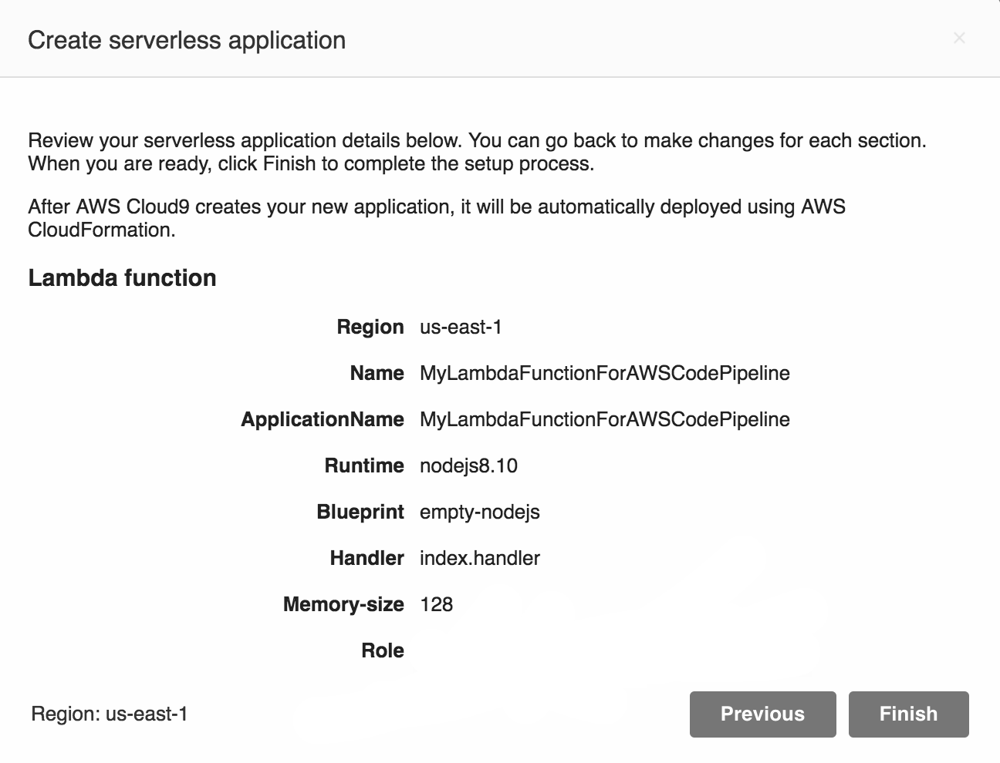
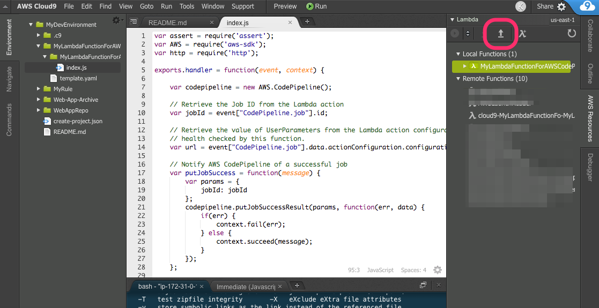
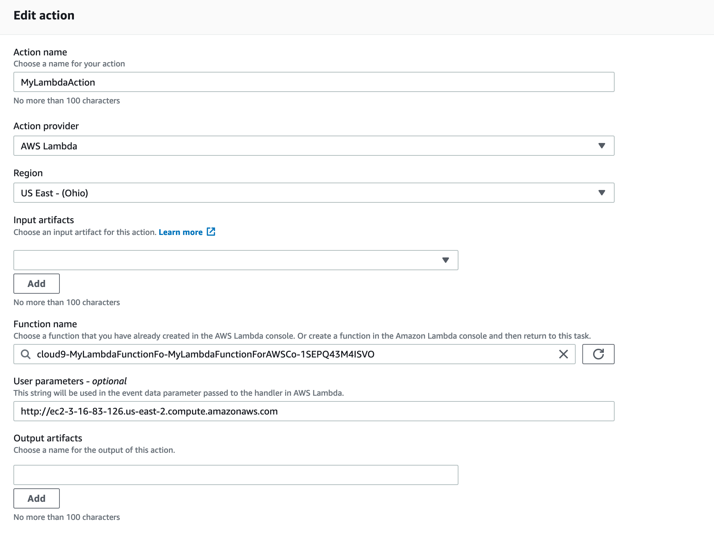

## Lab 4 (Optional) - Using Lambda as Test Stage in CodePipeline

### Stage 1: Create a sample Lambda function

1. Go to Cloud9 IDE
2. On the right hand side-menu, select **AWS Resources**
3. Expand Lambda, and select **λ+** [Create a lambda function]
4. Enter Function Name as **MyLambdaFunctionForAWSCodePipeline**
5. Click **Next**
6. Select runtime as **Node.js 8.10** and blue print as **empty-nodejs**
7. Click **Next**
8. Select Function trigger as **none** and click **Next**
9. For Role, select **choose an existing role** and select **CodePipelineLambdaExecRole** which we created as part of the Lab 1 setup.
10. Click **Next** and preview the changes. Once done, click **Finish**.


**Note:** Cloud9 will create a local Lambda function named MyLambdaFunctionForAWSCodePipeline.

11. Then **copy** the following code into the Lambda function **index.js** and **save** it.

```js
var assert = require('assert');
var AWS = require('aws-sdk');
var http = require('http');

exports.handler = function(event, context) {

    var codepipeline = new AWS.CodePipeline();

    // Retrieve the Job ID from the Lambda action
    var jobId = event["CodePipeline.job"].id;

    // Retrieve the value of UserParameters from the Lambda action configuration in AWS CodePipeline, in this case a URL which will be
    // health checked by this function.
    var url = event["CodePipeline.job"].data.actionConfiguration.configuration.UserParameters;

    // Notify AWS CodePipeline of a successful job
    var putJobSuccess = function(message) {
        var params = {
            jobId: jobId
        };
        codepipeline.putJobSuccessResult(params, function(err, data) {
            if(err) {
                context.fail(err);
            } else {
                context.succeed(message);
            }
        });
    };

    // Notify AWS CodePipeline of a failed job
    var putJobFailure = function(message) {
        var params = {
            jobId: jobId,
            failureDetails: {
                message: JSON.stringify(message),
                type: 'JobFailed',
                externalExecutionId: context.invokeid
            }
        };
        codepipeline.putJobFailureResult(params, function(err, data) {
            context.fail(message);
        });
    };

    // Validate the URL passed in UserParameters
    if(!url || url.indexOf('http://') === -1) {
        putJobFailure('The UserParameters field must contain a valid URL address to test, including http:// or https://');
        return;
    }

    // Helper function to make a HTTP GET request to the page.
    // The helper will test the response and succeed or fail the job accordingly
    var getPage = function(url, callback) {
        var pageObject = {
            body: '',
            statusCode: 0,
            contains: function(search) {
                return this.body.indexOf(search) > -1;
            }
        };
        http.get(url, function(response) {
            pageObject.body = '';
            pageObject.statusCode = response.statusCode;

            response.on('data', function (chunk) {
                pageObject.body += chunk;
            });

            response.on('end', function () {
                callback(pageObject);
            });

            response.resume();
        }).on('error', function(error) {
            // Fail the job if our request failed
            putJobFailure(error);
        });
    };

    getPage(url, function(returnedPage) {
        try {
            // Check if the HTTP response has a 200 status
            assert(returnedPage.statusCode === 200);
            // Check if the page contains the text "Congratulations"
            // You can change this to check for different text, or add other tests as required
            assert(returnedPage.contains('A Sample web application'));

            // Succeed the job
            putJobSuccess("Tests passed.");
        } catch (ex) {
            // If any of the assertions failed then fail the job
            putJobFailure(ex);
        }
    });
};
```

12. Lets deploy the modified function by clicking the deploy button as shown below.


13. Review the deployment changes by visiting the [Lambda console](https://console.aws.amazon.com/lambda). 

***

### Stage 2: Add the Lambda Function to a Pipeline in the AWS CodePipeline Console

In this step, you will add a new stage to your pipeline, and then add an action — a Lambda action that calls your function in that stage.

1. **Edit** the pipeline. Choose the option to add a stage after the **Deploy** stage with the AWS CodeDeploy action. Type a name for the stage (for example, **LambdaTest**).

**_Note_**
You can also choose to add your Lambda action to an existing stage. For demonstration purposes, we are adding the Lambda function as the only action in a stage to allow you to easily view its progress as artifacts progress through a pipeline. The event object, under the CodePipeline.job key, contains the [job details](http://docs.aws.amazon.com/codepipeline/latest/APIReference/API_JobDetails.html). For a full example of the JSON event AWS CodePipeline returns to Lambda, see [Example JSON Event](http://docs.aws.amazon.com/codepipeline/latest/userguide/actions-invoke-lambda-function.html#actions-invoke-lambda-function-json-event-example).

2. Choose **+ Add action group**,
- Type a name for your Lambda action (for example, **MyLambdaAction**).
- For **Action Provider**, choose **AWS Lambda**.
- For **Function name**, choose or type the name of your Lambda function (for example, **MyLambdaFunctionForAWSCodePipeline**).
- For **User parameters**, specify **http://** and the Public DNS address for the Amazon EC2 **DevWebApp01** instance you copied earlier (for example, http://ec2-52-62-36-220.ap-southeast-2.compute.amazonaws.com), and then choose **Save**.

3. Finally, save changes to pipeline by clicking **Save** button on top..



***

### Stage 3: Test the Pipeline with the Lambda function

To test the function, release the most recent change through the pipeline.

**_To use the console to run the most recent version of an artifact through a pipeline_**

1. On the pipeline details page, choose **Release change**. This will run the most recent revision available in each source location specified in a source action through the pipeline.
2. When the Lambda action is complete, choose the **Details** link to view the log stream for the function in Amazon CloudWatch, including the billed duration of the event. If the function failed, the CloudWatch log will provide information about the cause.

### Summary

This **concludes Lab 4**. In this lab, we successfully created Lambda function to test our application deployment. Now that you've successfully created a Lambda function and added it as an action in a pipeline, you can modify the Lambda function to check for a different text string.

You can now proceed to cleanup all the resources

[Cleanup](README.md#clean-up)
