## Lab 5 - Integrating SonarCloud to code analysis of the App 
In this lab, we will demonstrate how SonarCloud can be integrated with AWS CodePipeline using AWS CodeBuild.
SonarCloud is a code analysis as a service provided by SonarQube. This tool provides a defined process to enforce code control on three levels—syntax, code standards, and structure—before the code reaches the testing stage can address these challenges and help the developer release high-quality code every time.

### Prerequisites:
In order to do this lab you need GitHub account to login to SonarCloud. 

### Stage 1: SonarCloud Setup

1. Sign in to GitHub through the SonarCloud site using your GitHub credentials, as shown in the following screenshot.

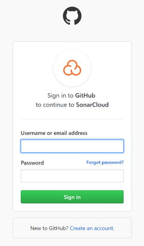

2. Choose **Create a new project** in the SonarCloud portal, as shown in the following screenshot.

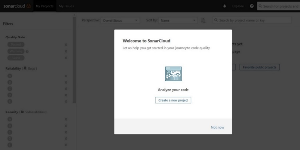

3. Choose **Choose an organization** in GitHub, as shown in the following screenshot.

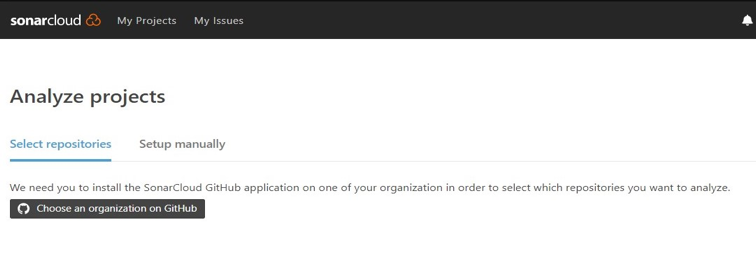

4. Choose **Install** after selecting the required repositories, as shown in the following screenshot.

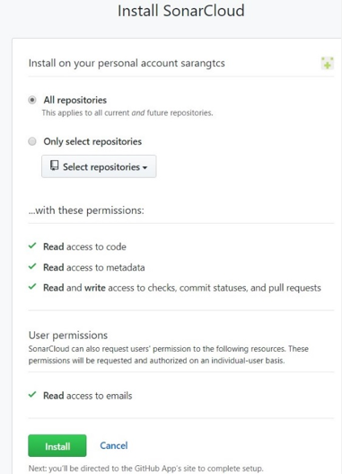

5. Your GitHub repository is now synchronized with SonarCloud. Bind the GitHub branch and choose Create Organization, as shown in the following screenshot.

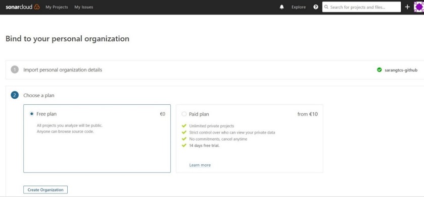

6. To generate a token, to go **User > My Account > Security**. Your existing tokens are listed here, each with a Revoke button. Enter a new Token name and Click **Generate**.  Store it for the succeeding steps.

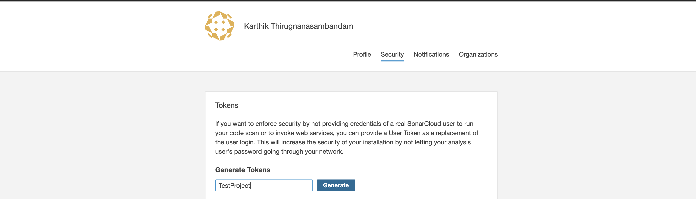

7. Select **Analyze new project**.
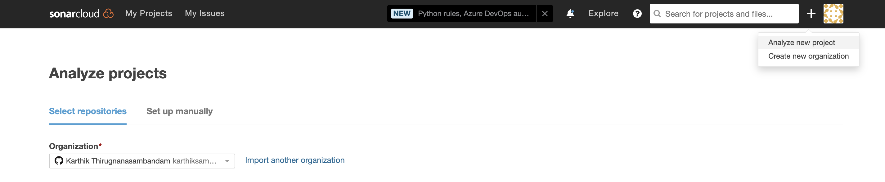

8. Select **Set up manually**. Add a new **Project key** and click **Set up**.

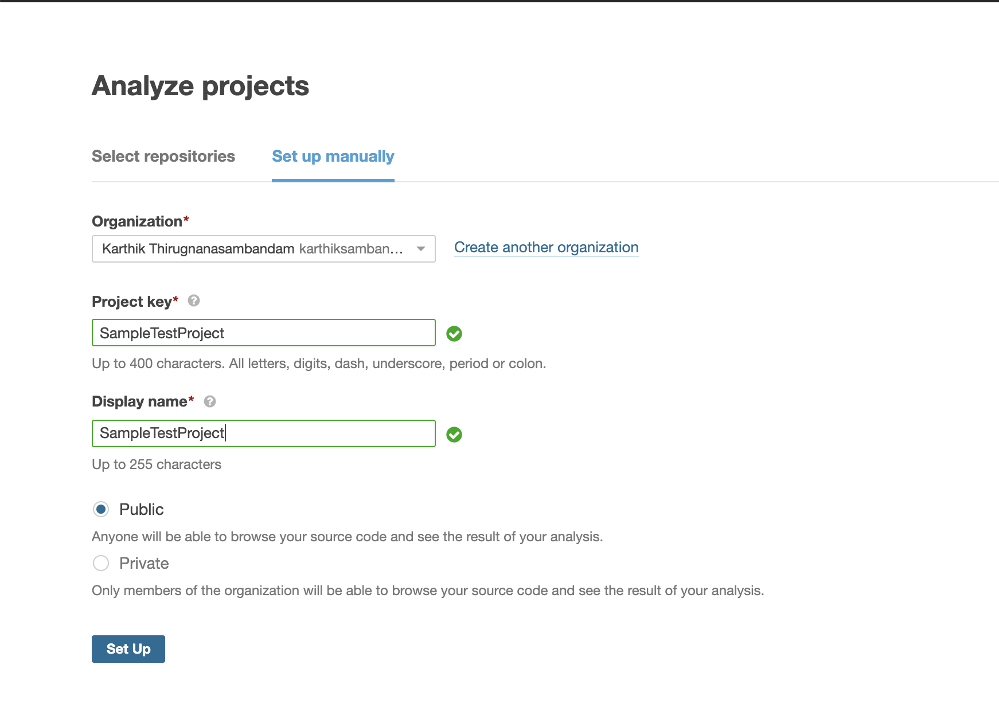

**Note:** We will use the Project key, Organization and token in the next step to configure CodeBuild.

### Stage 2: Configure SecretManager

We will use AWS Secret Manager to store the sonar login credentials. By using Secrets Manager we can provide controlled access to the credentials from CodeBuild.

1. Visit AWS Secret Manager console to setup the sonar login credentials.

2. Select **Store a new secret**. And choose **Other types of secret**

3. Enter secret keys and values as shown below. Enter the values based on your Organization, project and token.

4. Enter the secret name. In this case, we will use **“test/sonar”** and save with default settings.

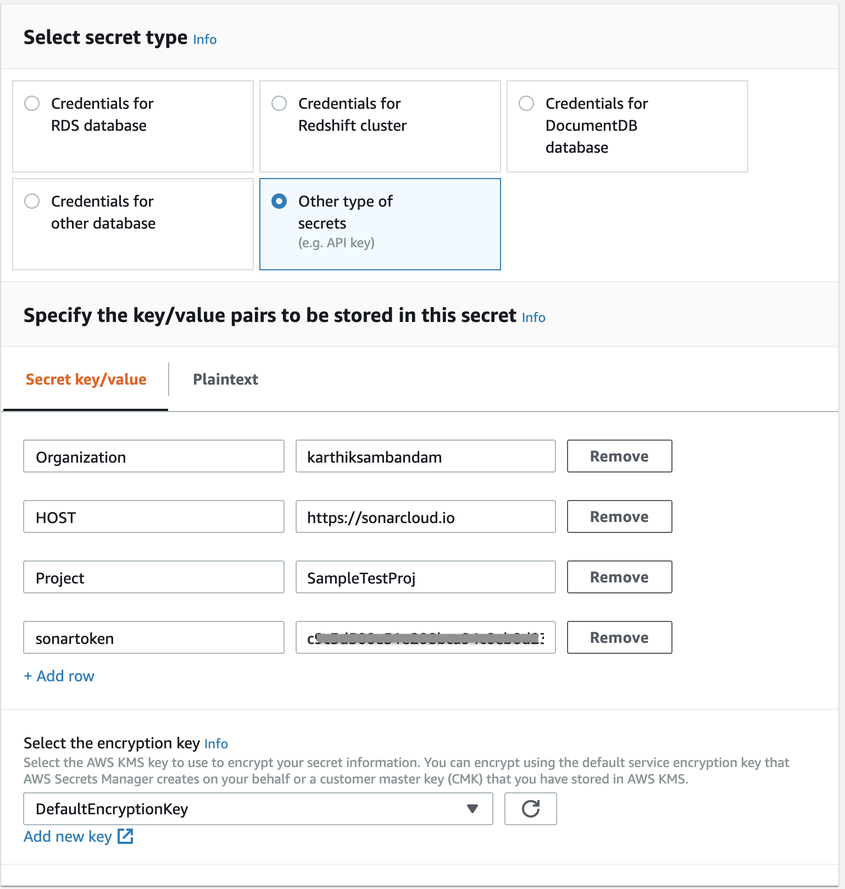

### Stage 3: Configuring AWS CodeBuild

1. Let us **create CodeBuild** project from **CLI** to review the code using SonarCloud. To create the build project using AWS CLI, we need JSON-formatted input.
    **_Create_** a json file named **_'create-sonar-project.json'_** under 'MyDevEnvironment'.Copy the content below to create-project.json. (Replace the placeholders marked with **_<<>>_** with  values for BuildRole ARN and region from the previous step.) 
    

```json
{
  "name": "sonar-review-project",
  "source": {
    "type": "CODECOMMIT",
    "location": "https://git-codecommit.<<REPLACE-YOUR-REGION-ID>>.amazonaws.com/v1/repos/WebAppRepo",
    "buildspec": "buildspec_sonar.yml"

  },
  "artifacts": {
    "type": "NO_ARTIFACTS"
  },
  "environment": {
    "type": "LINUX_CONTAINER",
    "image": "aws/codebuild/standard:3.0",
    "computeType": "BUILD_GENERAL1_SMALL"
  },
  "serviceRole": "<<REPLACE-YOUR-BuildRole-ARN>>"
}
```

2. Switch to the directory that contains the file you just saved, and run the **_create-sonar-project_** command:

```console
user:~/environment $ aws codebuild create-project --cli-input-json file://create-sonar-project.json
```

### Stage 3: Configuring AWS CodePipeline to integrate review stage

In this step, you will add a new stages to your pipeline to review the code using SonarCloud before building the code.

1. **Edit** the pipeline. Choose the option to add a stage after the **Source** stage with the AWS CodeBuild action. Type a name for the stage (for example, **CodeReview**).

2. Choose **+ Add action group**,
- Type a name for your action (for example, **CodeAnalysis**).
- For **Action Provider**, choose **AWS CodeBuild**.
- In **Input artifacts**: select the **Source Artifact**
- In **Project name**, and **Select** an **sonar-review-project**
- In **Output artifacts**: Type  **ReviewedArtifact**

3. Choose **Done**.

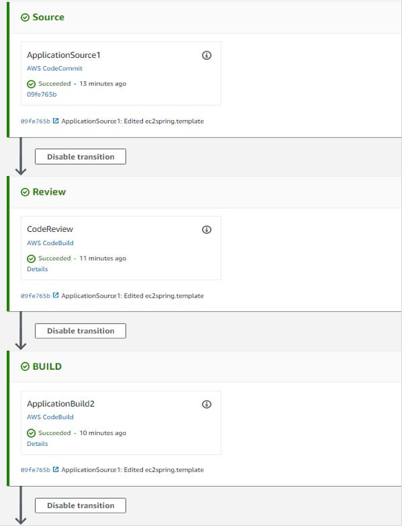

4. Save changes to pipeline by clicking **Save** button on top of the page.

### Stage 4: Testing review stage

1. Create a file namely, **_buildspec_sonar.yml_** under **WebAppRepo** folder. Copy the content below to the file and **save** it. 

```yaml

version: 0.2
env:
  secrets-manager:
    LOGIN: test/sonar:sonartoken
    HOST: test/sonar:HOST
    Organization: test/sonar:Organization
    Project: test/sonar:Project
phases:
  install:
    runtime-versions:
      java: openjdk8
  pre_build:
    commands:
      - apt-get update
      - apt-get install -y jq
      - wget http://www-eu.apache.org/dist/maven/maven-3/3.5.4/binaries/apache-maven-3.5.4-bin.tar.gz
      - tar xzf apache-maven-3.5.4-bin.tar.gz
      - ln -s apache-maven-3.5.4 maven
      - wget https://binaries.sonarsource.com/Distribution/sonar-scanner-cli/sonar-scanner-cli-3.3.0.1492-linux.zip
      - unzip ./sonar-scanner-cli-3.3.0.1492-linux.zip
      - export PATH=$PATH:/sonar-scanner-3.3.0.1492-linux/bin/
  build:
    commands:
      - mvn test     
      - mvn sonar:sonar -Dsonar.login=$LOGIN -Dsonar.host.url=$HOST -Dsonar.projectKey=$Project -Dsonar.organization=$Organization
      - sleep 5
      - curl https://sonarcloud.io/api/qualitygates/project_status?projectKey=$Project >result.json
      - cat result.json
      - if [ $(jq -r '.projectStatus.status' result.json) = ERROR ] ; then $CODEBUILD_BUILD_SUCCEEDING -eq 0 ;fi

```

Note: Check the secret manager setting in the buildspec to match with the secrets value you have created.

2. Commit & push the build specification files to repository

```console
user:~/environment/WebAppRepo/ $ git add *
user:~/environment/WebAppRepo/ $ git commit -m "adding buildspec_sonar.yml"
user:~/environment/WebAppRepo/ $ git push -u origin master
```

Check the pipeline for detecting the commit changes and executing the steps.

3. The Code Review status of the project can be also be verified in the [SonarCloud](https://sonarcloud.io/dashboard?id=%3cProject_Name%3e) dashboard, as shown in the following screenshot.

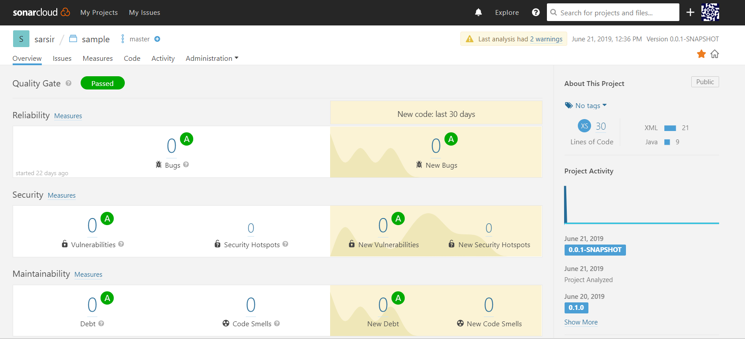

**Note:** Quality Gate is a feature in SonarCloud that can be configured to ensure coding standards are met and regulated across projects. You can set threshold measures on your projects like code coverage, technical debt measure, number of blocker/critical issues, security rating/unit test pass rate, and more. The last step calls the Quality Gate API to check if the code is satisfying all the conditions set in Quality Gate. Refer to the Quality Gate documentation for more information.

Quality Gate can return four possible responses:

    - **ERROR:** The project fails the Quality Gate.
    - **WARN:** The project has some irregularities but is ok to be passed on to production.
    - **OK:** The project successfully passes the Quality Gate.
    - **None:** The Quality Gate is not attached to project.
AWS CodeBuild provides several environment variables that you can use in your build commands. **CODEBUILD_BUILD_SUCCEEDING** is a variable used to indicate whether the current build is succeeding. Setting the value to 0 indicates the build status as failure and 1 indicates the build as success.

Using the Quality Gate **ERROR** response, set the **CODEBUILD_BUILD_SUCCEEDING** variable to failure. Accordingly, the CodeBuild status can be used to provide response for the pipeline to proceed or to stop.

### Summary

This **concludes Lab 6**. In this blog, we demonstrated how to integrate SonarCloud with CodePipeline using CodeBuild. With this solution, you can automate static code analysis every time you have a check-in in your source code tool.