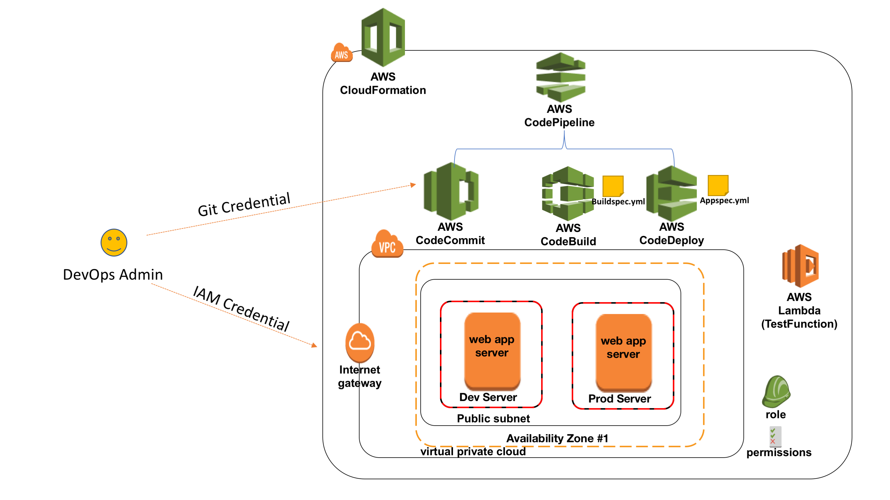
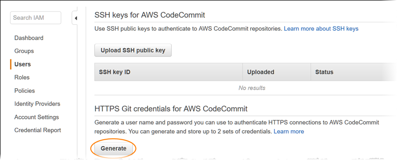

# AWS DevOps Essentials

## An Introductory Workshop on CI/CD Practices

In few hours, quickly learn how to effectively leverage various AWS services to improve developer productivity and reduce the overall time to market for new product capabilities. In this session, we will demonstrate a prescriptive approach to incrementally adopt and embrace some of the best practices around continuous integration & delivery using AWS Developer Tools and 3rd party solutions including, AWS CodeCommit (a managed source control service), AWS CodeBuild (a fully managed build service), Jenkins (an open source automated build server), CodePipeline (a fully managed continuous delivery service), and CodeDeploy (an automated application deployment service). We will also highlight some best practices and productivity tips that can help make your software release process fast, automated, and reliable.

See the diagram below for a depiction of the complete architecture.

## Prerequisites

* **Configure AWS CodeCommit:** The easiest way to set up AWS CodeCommit is to configure HTTPS Git credentials for AWS CodeCommit. On the user details page in IAM console, choose the **Security Credentials** tab, and in **HTTPS Git credentials for AWS CodeCommit**, choose **Generate**. 
        **💡 Note:** Make Note of the Git HTTP credentials handy. It will be used for cloning and pushing changes to Repo.
          Also, You can find detail instruction on how to configure HTTPS Git Credential [here](https://docs.aws.amazon.com/codecommit/latest/userguide/setting-up-gc.html)
* **IAM Permissions:** Finally, for the AWS account ensure you have sufficient privileges. You must have permissions for the following services:

AWS Identity and Access Management

Amazon Simple Storage Service

AWS CodeCommit

AWS CodeBuild

AWS CloudFormation

AWS CodeDeploy

AWS CodePipeline

AWS Cloud9

Amazon EC2

Amazon SNS

***

### **Important:**

Select the region of your choice for the lab. Kindly the select the region which has all four Code* services. You can find the [region services list](https://aws.amazon.com/about-aws/global-infrastructure/regional-product-services/). Stick to the same region throughout all labs. **Make sure you have not reached the VPC or Internet Gateway limits for that region. If you already have 5 VPCs/IGWs, delete at least one before you proceed or choose an alternate region.** 

# Labs
This workshop is broken into multiple labs. You must complete each Lab before proceeding to the next.

1. [Lab 1 - Build project on the cloud](1_Lab1.md) 
2. [Lab 2 - Automate deployment for testing](2_Lab2.md)
3. [Lab 3 - Setup CI/CD using AWS CodePipeline](3_Lab3.md)
4. [Lab 4 - Using Lambda as Test Stage in CodePipeline](4_Lab4.md)

## Clean up

1. Visit [CodePipeline console,](https://console.aws.amazon.com/codepipeline/home) select the created pipeline. Select the Edit and click **Delete**.
2. Visit [CodeDeploy console,](https://console.aws.amazon.com/codedeploy/home) select the created application. In the next page, click **Delete Application**.
3. Visit [CodeBuild console,](https://console.aws.amazon.com/codebuild/home) select the created project. Select the Action and click **Delete**.
4. Visit [CodeCommit console,](https://console.aws.amazon.com/codecommit/home) select the created repository. Go to setting and click **Delete repository**.
5. Visit [Lambda console,](https://console.aws.amazon.com/lambda/home) select the created function. Select the Action and click **Delete**.
6. Visit [Cloudformation console,](https://console.aws.amazon.com/cloudformation/home) select the created stacks. Select the Action and click **Delete Stack**.
7. Visit [Cloud9 console,](https://console.aws.amazon.com/cloud9/home) select the created Environment. Select the Action and click **Delete**.
8. Visit [Simple Notification Service console,](https://console.aws.amazon.com/sns/home) select Topics. Select the created topic.  Select the Action and click **Delete topics**. Next select Subscriptions. Select the created subscription. Select the Action and click **Delete subscriptions**.

## License

This library is licensed under the Apache 2.0 License. 
