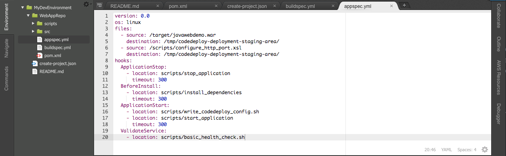
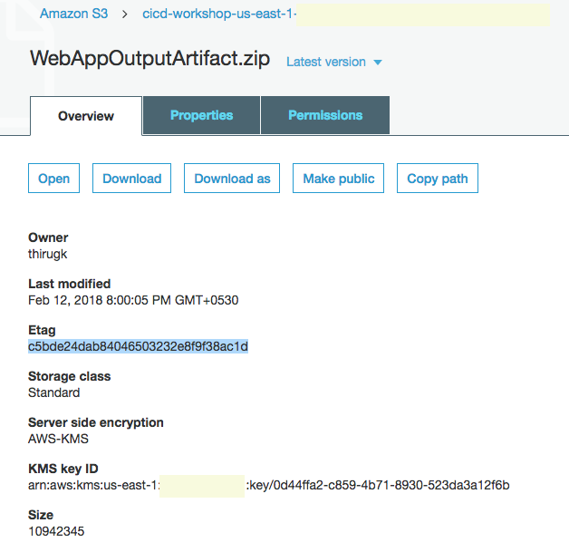

# AWS DevOps Essentials

## An Introductory Workshop on CI/CD Practices

In few hours, quickly learn how to effectively leverage various AWS services to improve developer productivity and reduce the overall time to market for new product capabilities. In this session, we will demonstrate a prescriptive approach to incrementally adopt and embrace some of the best practices around continuous integration & delivery using AWS Developer Tools and 3rd party solutions including, AWS CodeCommit (a managed source control service), AWS CodeBuild (a fully managed build service), Jenkins (an open source automated build server), CodePipeline (a fully managed continuous delivery service), and CodeDeploy (an automated application deployment service). We will also highlight some best practices and productivity tips that can help make your software release process fast, automated, and reliable.

## Prerequisites

* **Configure AWS CodeCommit:** The easiest way to set up AWS CodeCommit is to configure HTTPS Git credentials for AWS CodeCommit. On the user details page in IAM console, choose the **Security Credentials** tab, and in **HTTPS Git credentials for AWS CodeCommit**, choose **Generate**. 
        **💡 Note:** Make Note of the Git HTTP credentials handy. It will be used for cloning and pushing changes to Repo.
          Also, You can find detail instruction on how to configure HTTPS Git Credential [here](https://docs.aws.amazon.com/codecommit/latest/userguide/setting-up-gc.html)
* **IAM Permissions:** Finally, for the AWS account ensure you have sufficient privileges. You must have permissions for the following services:

AWS Identity and Access Management

Amazon Simple Storage Service

AWS CodeCommit

AWS CodeBuild

AWS CloudFormation

AWS CodeDeploy

AWS CodePipeline

AWS Cloud9

Amazon EC2

Amazon SNS

***

### **Important:**

Select the region of your choice for the lab. Kindly the select the region which has all four Code* services. You can find the [region services list](https://aws.amazon.com/about-aws/global-infrastructure/regional-product-services/). Stick to the same region throughout all labs.

## Lab 1 - Build project on the cloud

### AWS Cloud9 IDE - Set up

AWS Cloud9 is a cloud-based integrated development environment (IDE) that lets you write, run, and debug your code with just a browser. It includes a code editor, debugger, and terminal. Cloud9 comes pre-packaged with essential tools for popular programming languages and the AWS Command Line Interface (CLI) pre-installed so you don't need to install files or configure your laptop for this workshop. Your Cloud9 environment will have access to the same AWS resources as the user with which you logged into the AWS Management Console.

Take a moment now and setup your Cloud9 development environment.

### ✅  Step-by-step Instructions**

1. Go to the AWS Management Console, click **Services** then select **Cloud9** under Developer Tools.
2. Click **Create environment**.
3. Enter `MyDevEnvironment` into **Name** and optionally provide a **Description**.
4. Click **Next step**.
5. You may leave **Environment settings** at their defaults of launching a new **t2.micro** EC2 instance which will be paused after **30 minutes** of inactivity.
6. Click **Next step**.
7. Review the environment settings and click **Create environment**. It will take several minutes for your environment to be provisioned and prepared.
8. Once ready, your IDE will open to a welcome screen. Below that, you should see a terminal prompt similar to:  You can run AWS CLI commands in here just like you would on your local computer. Verify that your user is logged in by running `aws sts get-caller-identity`.

```cmd
aws sts get-caller-identity
```

You'll see output indicating your account and user information:

```cmd
Admin:~/environment $ aws sts get-caller-identity
```

```cmd
{
    "Account": "123456789012",
    "UserId": "AKIAI44QH8DHBEXAMPLE",
    "Arn": "arn:aws:iam::123456789012:user/Alice"
}
```

Keep your AWS Cloud9 IDE opened in a tab throughout this workshop as we'll use it for activities like cloning, pushing changes to repository and using the AWS CLI.

### 💡 Tips

Keep an open scratch pad in Cloud9 or a text editor on your local computer for notes. When the step-by-step directions tell you to note something such as an ID or Amazon Resource Name (ARN), copy and paste that into the scratch pad.

***

### Stage 1: Create an AWS CodeCommit Repository

**_To create the AWS CodeCommit repository (console)_**

1. Open the AWS CodeCommit console at <https://console.aws.amazon.com/codecommit>.
2. In the region selector, choose the region where you will create the repository. For more information, see [Regions and Git Connection Endpoints](http://docs.aws.amazon.com/codecommit/latest/userguide/regions.html).
3. On the Welcome page, choose Get Started Now. (If a **_Dashboard_** page appears instead, choose **_Create repository_**.)
4. On the **_Create repository_** page, in the **_Repository name_** box, type **_WebAppRepo_**.
5. In the **_Description_** box, type **_My demonstration repository_**.
6. Choose **_Create repository_** to create an empty AWS CodeCommit repository named **_WebAppRepo_**.

**_Note_** The remaining steps in this tutorial assume you have named your AWS CodeCommit repository **_WebAppRepo_**. If you use a name other than **_WebAppRepo_**, be sure to use it throughout this tutorial. For more information about creating repositories, including how to create a repository from the terminal or command line, see [Create a Repository](http://docs.aws.amazon.com/codecommit/latest/userguide/how-to-create-repository.html).

***

### Stage 2: Clone the Repo

In this step, you will connect to the source repository created in the previous step. Here, you use Git to clone and initialize a copy of your empty AWS CodeCommit repository. Then you specify the user name and email address used to annotate your commits.

1. From CodeCommit Console, you can get the **https clone url** link for your repo.
2. Go to Cloud9 IDE terminal prompt
3. Run git clone to pull down a copy of the repository into the local repo:

```cmd
git clone https://git-codecommit.<YOUR-REGION>.amazonaws.com/v1/repos/WebAppRepo

```

Provide your Git HTTPs credential when prompted. You would be seeing the following message if cloning is successful. ***warning: You appear to have cloned an empty repository.***

***

### Stage 3: Commit changes to Remote Repo

1. Download the Sample Web App Archive by running the following command from IDE terminal.

```cmd
wget https://github.com/awslabs/aws-devops-essential/raw/master/sample-app/Web-App-Archive.zip
```

2. Unarchive and copy all the **_contents_** of the unarchived folder to your local repo folder.

```cmd
unzip Web-App-Archive.zip
mv -v Web-App-Archive/* WebAppRepo/
```

After moving the files, your local repo should like the one below. 
3. Change the directory to your local repo folder. Run **_git add_** to stage the change:

```cmd
cd WebAppRepo
git add *
```

4. Run **_git commit_** to commit the change:

```cmd
git commit -m "Initial Commit"
```

**_💡 Tip_** To see details about the commit you just made, run **_git log_**.

5. Run **_git config credential_** to store the credential.

```cmd
git config credential.helper store
```

6. Run **_git push_** to push your commit through the default remote name Git uses for your AWS CodeCommit repository (origin), from the default branch in your local repo (master):

```cmd
git push -u origin master
```

Provide your Git HTTPs credential when prompted. Credential helper will store it, hence you won't be asked again for subsequent push.

**_💡 Tip_** After you have pushed files to your AWS CodeCommit repository, you can use the AWS CodeCommit console to view the contents. For more information, see [Browse the Contents of a Repository](http://docs.aws.amazon.com/codecommit/latest/userguide/how-to-browse.html).

***

### Stage 4: Prepare Build Service

1. First, let us create the necessary roles required to finish labs. Run the CloudFormation stack to create service roles.
  Ensure you are launching it in the same region as your AWS CodeCommit repo.

```cmd
aws cloudformation create-stack --stack-name DevopsWorkshop-roles --template-body https://github.com/awslabs/aws-devops-essential/raw/master/templates/01-aws-devops-workshop-roles.template --capabilities CAPABILITY_IAM
```

**_Tip_** To learn more about AWS CloudFormation, please refer to [AWS CloudFormation UserGuide.](https://docs.aws.amazon.com/AWSCloudFormation/latest/UserGuide/Welcome.html)

2. Upon completion take a note on the service roles created. Check [describe-stacks](http://docs.aws.amazon.com/cli/latest/reference/cloudformation/describe-stacks.html) to find the output of the stack.

3. For Console, refer to the CloudFormation [Outputs tab](http://docs.aws.amazon.com/AWSCloudFormation/latest/UserGuide/cfn-console-view-stack-data-resources.html) to see output. A S3 Bucket is also created. Make a note of this bucket. This will be used to store the output from CodeBuild in the next step. **_Sample Output:_** 
4. Let us **create CodeBuild** project from **CLI**. To create the build project using AWS CLI, we need JSON-formatted input.
    **_Create_** a json file named **_'create-project.json'_** under 'MyDevEnvironment'.  Copy the content below to create-project.json. (Replace the placeholders marked with **_<<>>_** with your own values.) To know more about the codebuild project json [review the spec](http://docs.aws.amazon.com/codebuild/latest/userguide/create-project.html#create-project-cli).

```json
{
  "name": "devops-webapp-project",
  "source": {
    "type": "CODECOMMIT",
    "location": "https://git-codecommit.<<YOUR-REGION-ID>>.amazonaws.com/v1/repos/WebAppRepo"
  },
  "artifacts": {
    "type": "S3",
    "location": "<<YOUR-CODEBUILD-OUTPUT-BUCKET>>",
    "packaging": "ZIP",
    "name": "WebAppOutputArtifact.zip"
  },
  "environment": {
    "type": "LINUX_CONTAINER",
    "image": "aws/codebuild/java:openjdk-8",
    "computeType": "BUILD_GENERAL1_SMALL"
  },
  "serviceRole": "<<BuildRoleArn-Value-FROM-CLOUDFORMATION-OUTPUT>>"
}
```

5. Switch to the directory that contains the file you just saved, and run the **_create-project_** command:

```cmd
aws codebuild create-project --cli-input-json file://create-project.json
```

6. Sample output JSON for your reference

```json
{
  "project": {
    "name": "project-name",
    "description": "description",
    "serviceRole": "serviceRole",
    "tags": [
      {
        "key": "tags-key",
        "value": "tags-value"
      }
    ],
    "artifacts": {
      "namespaceType": "namespaceType",
      "packaging": "packaging",
      "path": "path",
      "type": "artifacts-type",
      "location": "artifacts-location",
      "name": "artifacts-name"
    },
    "lastModified": lastModified,
    "timeoutInMinutes": timeoutInMinutes,
    "created": created,
    "environment": {
      "computeType": "computeType",
      "image": "image",
      "type": "environment-type",
      "environmentVariables": [
        {
          "name": "environmentVariable-name",
          "value": "environmentVariable-value",
          "type": "environmentVariable-type"
        }
      ]
    },
    "source": {
      "type": "source-type",
      "location": "source-location",
      "buildspec": "buildspec",
      "auth": {
        "type": "auth-type",
        "resource": "resource"
      }
    },
    "encryptionKey": "encryptionKey",
    "arn": "arn"
  }
}
```

7. If successful, output JSON should have values such as:
  * The lastModified value represents the time, in Unix time format, when information about the build project was last changed.
  * The created value represents the time, in Unix time format, when the build project was created.
  * The ARN value represents the ARN of the build project.

**_Note_** Except for the build project name, you can change any of the build project's settings later. For more information, see [Change a Build Project's Settings (AWS CLI)](http://docs.aws.amazon.com/codebuild/latest/userguide/change-project.html#change-project-cli).

***

### Stage 5: Let's build the code on cloud

1. A build spec is a collection of build commands and related settings in YAML format, that AWS CodeBuild uses to run a build.
    Create a file namely, **_buildspec.yml_** under **WebAppRepo** folder. Copy the content below to the file and save it. To know more about [how CodeBuild works](http://docs.aws.amazon.com/codebuild/latest/userguide/concepts.html#concepts-how-it-works).

```
version: 0.1

phases:
  install:
    commands:
      - echo Nothing to do in the install phase...
  pre_build:
    commands:
      - echo Nothing to do in the pre_build phase...
  build:
    commands:
      - echo Build started on `date`
      - mvn install
  post_build:
    commands:
      - echo Build completed on `date`
artifacts:
  files:
    - target/javawebdemo.war
  discard-paths: yes
```

As a sample shown below:


**_Note_** Visit this [page](http://docs.aws.amazon.com/codebuild/latest/userguide/build-spec-ref.html) to know more about build spec and how you can use multiple build specs in the same repo.

2. Run the **_start-build_** command:

```cmd
aws codebuild start-build --project-name devops-webapp-project
```

**_Note:_** You can start build with more advance configuration setting via JSON. If you are interested to learn more about it, please visit [here](http://docs.aws.amazon.com/codebuild/latest/userguide/run-build.html#run-build-cli).

3. If successful, data would appear showing successful submission. Make a note of the build id value. You will need it in the next step.
4. In this step, you will view summarized information about the status of your build.

```cmd
aws codebuild batch-get-builds --ids <<ID>>
```

**_Note:_** Replace <<ID>> with the id value that appeared in the output of the previous step.

5. Did the build succeed? if the build failed, why? The reason is build spec YAML file is not pushed to the repository. Push the code changes by **git add, commit, and push**. **Repeat** steps from 2 through 4.
6. You will also be able to view detailed information about your build in CloudWatch Logs. You can complete this step by visiting the AWS CodeBuild console.
7. In this step, you will verify the **_WebAppOutputArtifact.zip_** file that AWS CodeBuild built and then uploaded to the output bucket. You can complete this step by **visiting** the **AWS CodeBuild console** or the **Amazon S3 console**.

**_Note:_** Troubleshooting CodeBuild - Use the [information](http://docs.aws.amazon.com/codebuild/latest/userguide/troubleshooting.html) to help you identify, diagnose, and address issues.

### Summary:

This **concludes Lab 1**. In this lab, we successfully created repository with version control using AWS CodeCommit and built our code on the cloud using AWS CodeBuild service.

**_✅ Do It Yourself (DIY):_** Using the CodeCommit Console try to do the following tasks. - Create an additional branch within your repository.

* Make changes to the new branch and compare the changes between branches.
* Enable triggers on your repository for specific events.

***

## Lab 2 - Automate deployment for testing

### Stage 1: Prepare environment for Testing

1. Run the CloudFormation stack using the following AWS CLI command:

```
aws cloudformation create-stack --stack-name DevopsWorkshop-Env --template-body https://github.com/awslabs/aws-devops-essential/raw/master/templates/02-aws-devops-workshop-environment-setup.template --capabilities CAPABILITY_IAM
```

**_Note_**
  - The Stack will have a VPC w/ 1 public subnet, an IGW, route tables, ACL, 2 EC2 instances. Also, the EC2 instances will be launched with a User Data script to **automatically install the AWS CodeDeploy agent**.
  - **Verify** that by visiting the **EC2 Console** and view option for **user data**.You would see the following script.

```cmd
#!/bin/bash -ex
yum install -y aws-cli
cd /home/ec2-user/
wget https://aws-codedeploy-us-east-1.s3.amazonaws.com/latest/codedeploy-agent.noarch.rpm
yum -y install codedeploy-agent.noarch.rpm
service codedeploy-agent start
```

  - You can refer to [this instruction](http://docs.aws.amazon.com/codedeploy/latest/userguide/codedeploy-agent-operations-install.html) to install the CodeDeploy agent for other OSs like Amazon Linux, RHEL, Ubuntu, or Windows.
  - AWS CodeDeploy can deploy to both Amazon EC2 instances and on-premises instances.To know more [visit](http://docs.aws.amazon.com/codedeploy/latest/userguide/instances.html).

***

### Stage 2: Create CodeDeploy Application and Deployment group

1. Run the following to create an application for CodeDeploy.

```cmd
aws deploy create-application --application-name DevOps-WebApp
```

2. Run the following to create a deployment group and associates it with the specified application and the user's AWS account. You need to replace the service role with **DeployRoleArn Value** we created using roles CFN stack.

```cmd
aws deploy create-deployment-group --application-name DevOps-WebApp  --deployment-config-name CodeDeployDefault.OneAtATime --deployment-group-name DevOps-WebApp-BetaGroup --ec2-tag-filters Key=Name,Value=DevWebApp01,Type=KEY_AND_VALUE --service-role-arn <<REPLACE-WITH-YOUR-CODEDEPLOY-ROLE-ARN>>
```

**_Note:_** We are using the tags to attach instances to the deployment group.

3. Let us review all the changes by visiting the CodeDeploy Console.

***

### Stage 3: Prepare application for deployment

1. Without an AppSpec file, AWS CodeDeploy cannot map the source files in your application revision to their destinations or run scripts at various stages of the deployment.
2. Copy the template into a text editor and save the file as **_appspec.yml_** in the **_WebAppRepo_** directory of the revision.

```yml
version: 0.0
os: linux
files:
  - source: /target/javawebdemo.war
    destination: /tmp/codedeploy-deployment-staging-area/
  - source: /scripts/configure_http_port.xsl
    destination: /tmp/codedeploy-deployment-staging-area/
hooks:
  ApplicationStop:
    - location: scripts/stop_application
      timeout: 300
  BeforeInstall:
    - location: scripts/install_dependencies
      timeout: 300
  ApplicationStart:
    - location: scripts/write_codedeploy_config.sh
    - location: scripts/start_application
      timeout: 300
  ValidateService:
    - location: scripts/basic_health_check.sh

```

As a sample shown below:



3. **_Review_** the **_script folder_** in the repo for the various scripts like Start, Stop, health check etc. These scripts will be called as per the hook definition in **_appsec.yml_** file during deployment.
4. Since we are going to deploy the application via CodeDeploy, we need to package additional files needed by CodeDeploy. Let us **_make change_** to the **_buildspec.yml_** to incorporate the changes.

```yml
version: 0.1

phases:
  install:
    commands:
      - echo Nothing to do in the install phase...
  pre_build:
    commands:
      - echo Nothing to do in the pre_build phase...
  build:
    commands:
      - echo Build started on `date`
      - mvn install
  post_build:
    commands:
      - echo Build completed on `date`
artifacts:
  files:
    - appspec.yml
    - scripts/**/*
    - target/javawebdemo.war

```

5. Save the changes to buildspec.yml. Run **_git add, commit, and push_** the changes to CodeCommit repo.

***

### Stage 4: Deploy an application revision

1. Run the **_start-build_** command:

```cmd
aws codebuild start-build --project-name devops-webapp-project
```

2. Visit the CodeBuild Console to ensure build is successful. Upon successful completion of build, we should see new **_WebAppOutputArtifact.zip_** upload to the configured CodeBuild S3 Bucket.
3. Get the **_eTag_** for the object **WebAppOutputArtifact.zip** uploaded to S3 bucket. You can get etag by visiting S3 console. Or, executing the following command.

```cmd
aws s3api head-object --bucket <<YOUR-CODEBUILD-OUTPUT-BUCKET>> --key WebAppOutputArtifact.zip

```

As a sample S3 properties console showing etag below:



4. Run the following to create a deployment. **_Replace_** <<YOUR-CODEBUILD-OUTPUT-BUCKET>> with your **_S3 bucket name_** created in Lab 1. Also, update the **_eTag_** based on previous step.

```cmd
aws deploy create-deployment --application-name DevOps-WebApp --deployment-group-name DevOps-WebApp-BetaGroup --description "My very first deployment" --s3-location bucket=<<YOUR-CODEBUILD-OUTPUT-BUCKET>>,key=WebAppOutputArtifact.zip,bundleType=zip,eTag=<<YOUR-ETAG-VALUE>>
```

5. **Verify** the deployment status by visiting the **CodeDeploy console**.
6. Check the deploy console for status. if the deployment failed, then look at the error message and correct the deployment issue.
7. if the status of deployment is success, we should be able to view the web application deployed successfully to the EC2 server namely **_DevWebApp01_**
8. Go to the **EC2 Console**, get the **public DNS name** of the server and open the url in a browser. You should see a sample web application.

### Summary

This **concludes Lab 2**. In this lab, we successfully created CodeDeploy application and deployment group. We also modified buildspec.yml to include additional components needed for deployment. We also successfully completed deployment of application to test server.

**_✅ Do It Yourself (DIY):_** Environment variable for CodeBuild. How can we specifiy environment variable for your Build Environment. Environment variable contains a mapping of key/value scalars, where each mapping represents a single custom environment variable in plain text. key is the name of the custom environment variable, and value is that variable's value. To know more about how to pass environment variable. [Check the build spec reference](http://docs.aws.amazon.com/codebuild/latest/userguide/build-spec-ref.html)

* Use SSM as Parameter Store.
* If you want to store environment variables outside, then use Amazon EC2 Systems Manager Parameter Store. [Check this for how to store parameter and secure them using KMS](http://docs.aws.amazon.com/systems-manager/latest/userguide/sysman-paramstore-walk.html#sysman-paramstore-console).
* To allow AWS CodeBuild to retrieve custom environment variables stored in Amazon EC2 Systems Manager Parameter Store, you must add the ssm:GetParameters action to your AWS CodeBuild service role.

***

## Lab 3 - Setup CI/CD using AWS CodePipeline

### Stage 1: Create a Pipeline (Console)

To create a pipeline in the console, you'll need to provide the source file location and information about the providers you will use for your actions.

When you use the pipeline wizard, AWS CodePipeline creates the names of stages (Source, Build, Staging). These names cannot be changed. However, you can delete Build and Staging if you prefer to alter the names. You can give more specific names (for example, BuildToGamma or DeployToProd) to stages you add later.

Also, existing pipeline configuration can be exported and used to create pipeline in another region.

1. Sign in to the **AWS Management Console** and open the **AWS CodePipeline** console at [http://console.aws.amazon.com/codepipeline](http://console.aws.amazon.com/codepipeline).
2. On the **Welcome** page, choose **Create pipeline**.

If this is your first time using AWS CodePipeline, an introductory page appears instead of **Welcome**. Choose **Get Started Now**.

3. On the **Step 1: Name** page, in the **Pipeline name** box, type the name for your pipeline, and then choose **Next step**.

Within a single AWS account, each pipeline you create in a region must have a unique name. Names can be reused for pipelines in different regions.

**_Note_**
After you create a pipeline, you cannot change its name. For information about other limitations, see [Limits in AWS CodePipeline](https://docs.aws.amazon.com/codepipeline/latest/userguide/limits.html).

4. On the **Step 2: Source** page, in the **Source provider** drop-down list, choose the type of repository where your source code is stored and specify its required options:
  - **AWS CodeCommit**: In **Repository name**, choose the name of the AWS CodeCommit repository you created in Lab 1 to use as the source location for your pipeline. In Branch name, from the drop-down list, choose the branch you want to use.
  - After you choose the AWS CodeCommit repository name and branch, a message is displayed in **Change Detection Mode** showing the Amazon CloudWatch Events rule that will be created for this pipeline. Leave default selection. Choose **Next step**.

5. On the **Step 3: Build** page, do the following, and then choose **Next step:**
  - Choose **AWS CodeBuild**, and then **Select** an **existing build project** we created in Lab 1.
  - Then choose **Next step**.

6. On the **Step 4: Deploy** page, do the following, and then choose Next step:
  - Choose the following default providers from the Deployment provider drop-down list:
    + **AWS CodeDeploy:** Type or choose the name of an existing AWS CodeDeploy application in Application name and the name of a deployment group for that application in Deployment group **created in Lab2** and then choose **Next step**.

7. On the **Step 5: Service Role** page, do the following, and then choose **Next step**:
  - In the **Service Role**, drop-down list, choose an IAM service role we **create in Lab 1** for AWS CodePipeline.

8. On the **Step 6: Review** page, review your pipeline configuration, and then choose **Create pipeline** to create the pipeline.

9. Now that you've created your pipeline, you can view it in the console. Pipeline will start automatically in few minutes. Otherwise, test it by manually clicking the **Release** button.

***

### Stage 2: Create CodeDeploy Deployment group for Production

1. Run the following to create a deployment group and associates it with the specified application and the user's AWS account. You need to replace the service role ARN we created using roles stack.

```cmd
aws deploy create-deployment-group --application-name DevOps-WebApp  --deployment-config-name CodeDeployDefault.OneAtATime --deployment-group-name DevOps-WebApp-ProdGroup --ec2-tag-filters Key=Name,Value=ProdWebApp01,Type=KEY_AND_VALUE --service-role-arn <<REPLACE-WITH-YOUR-CODEDEPLOY-ROLE-ARN>>
```

**_Note:_** We are using the different group name and Production tag to attach instance to the deployment group.

***

### Stage 3: Edit a Pipeline (Console)

You can use the AWS CodePipeline console to add, edit, or remove stages in a pipeline, as well as to add, edit, or remove actions in a stage.

We will edit the pipeline to add the stage for production deployment and introduce manual gating for production deployment.

1. On the pipeline details page, choose **Edit**. This opens the editing page for the pipeline.
2. To add a stage, choose **+ Stage** after the existing **Staging** Stage.
3. Provide a name for the stage as **Prod**, and then add an one action to it. Items marked with an asterisk are required.
4. The Add action panel opens. In Action category, choose the category as **Deploy**.
5. In **Deploy Action** section: provide name as **ProductionDeployment** and deployment provider as **AWS CodeDeploy**
6. In **AWS CodeDeploy:** Type or choose the name of an existing AWS CodeDeploy application in Application name and the name the **production deployment group** created previous stage
7. In **Input artifacts**: select the **MyAppBuild**
8. Choose **Add Action**.
9. Finally, save changes by clicking **Save pipeline changes** button.

***

### Stage 4: Add Manual approval action

In AWS CodePipeline, you can add an approval action to a stage in a pipeline at the point where you want the pipeline execution to stop so that someone with the required AWS Identity and Access Management permissions can approve or reject the action.

If the action is approved, the pipeline execution resumes. If the action is rejected—or if no one approves or rejects the action within seven days of the pipeline reaching the action and stopping—the result is the same as an action failing, and the pipeline execution does not continue.

1. **Create SNS topic** for Approval notification. And note the **topic ARN** from the result.

```cmd
aws sns create-topic --name WebApp-Approval-Topic
```

2. **Subscribe** to the topic using your email id. **Replace** the **ARN** and **email id** placeholders accordingly.

```cmd
aws sns subscribe --topic-arn <<YOUR-TOPIC-ARN>> --protocol email --notification-endpoint <<YOUR-EMAIL-ID>>
```

3. An Email would be sent for **confirmation** on the subscription. **Acknowledge** the subscription to receive mails from topic.
4. Choose **+ Stage** at the point in the pipeline **between Staging** and **Prod** stage, and type a name for the stage.
5. Choose the **+ action icon**.
6. On the **Add action** page, do the following:
7. In **Action category**, choose **Approval**.
8. In **Action name**, type a name to identify the action.
9. In **Approval type**, choose **Manual approval**.
10. In **SNS topic ARN**, choose the name of the topic created to send notifications for the approval action.
11. (Optional) In **Comments**, type any additional information you want to share with the reviewer.
12. Choose **Add action**.
13. To test your action, choose **Release change** to process that commit through the pipeline, commit a change to the source specified in the source stage of the pipeline.

***

### Stage 5: Approve or Reject an Approval Action in AWS CodePipeline

If you receive a notification that includes a direct link to an approval action, choose the **Approve or reject** link, sign in to the console if necessary, and then continue with step 7 below. Otherwise, use all the following steps.

1. Open the **AWS CodePipeline console** at https://console.aws.amazon.com/codepipeline/.
2. On the **All Pipelines** page, choose the name of the pipeline.
3. _Locate_ the stage with the approval action.
4. Hover over the information icon to view the comments and URL, if any. The information pop-up message will also display the URL of content for you to review, if one was included.
5. If a URL was provided, choose the **Manual approval** link in the action to open the target Web page, and then review the content.
6. Return to the pipeline details view, and then choose the **Review** button.
7. In the **Approve or reject** the revision window, type comments related to your review, such as why you are approving or rejecting the action, and then choose the **Approve** or **Reject** button.

### Summary

This **concludes Lab 3**. In this lab, we successfully created CodePipeline for continuous code build and deployment. We also modified CodePipeline to include manual approval action before deploying code to production environment. We also successfully completed continuos deployment of application to both test and production servers.

**_✅ Do It Yourself (DIY):_**

* Import and Export pipeline. Refer this [link](http://docs.aws.amazon.com/codepipeline/latest/userguide/pipelines-create.html#pipelines-create-cli)
* Using the CodeDeploy Console try to do the following tasks.
  - Enable triggers on your Production Deployment group for specific events.
  - Change the deployment type from In placement to BlueGreen. Also check various deployment config options.

***

## Lab 4 - Using Lambda as Test Stage in CodePipeline

### Stage 1: Create a sample Lambda function

1. Go to Cloud9 IDE
2. On the right hand side-menu, select **AWS Resources**
3. Expand Lambda, and select **λ+** [Create a lambda function]
4. Enter Function Name as **MyLambdaFunctionForAWSCodePipeline**
5. Click **Next**
6. Select runtime as **Node.js 6.10** and blue print as **empty-nodejs**
7. Click **Next**
8. Select Function trigger as **None** and click **Next**
9. For Role, select **choose an existing role** and select **CodePipelineLambdaExecRole** which we created as part of the Lab 1 setup.
10. Click **Next** and preview the changes. Once done, click **Finish**.
**Note:**
Cloud9 will create a local Lambda function named MyLambdaFunctionForAWSCodePipeline.
11. Then **copy** the following code into the Lambda function index.js and **save** it.

```js
var assert = require('assert');
var AWS = require('aws-sdk');
var http = require('http');

exports.handler = function(event, context) {

    var codepipeline = new AWS.CodePipeline();

    // Retrieve the Job ID from the Lambda action
    var jobId = event["CodePipeline.job"].id;

    // Retrieve the value of UserParameters from the Lambda action configuration in AWS CodePipeline, in this case a URL which will be
    // health checked by this function.
    var url = event["CodePipeline.job"].data.actionConfiguration.configuration.UserParameters;

    // Notify AWS CodePipeline of a successful job
    var putJobSuccess = function(message) {
        var params = {
            jobId: jobId
        };
        codepipeline.putJobSuccessResult(params, function(err, data) {
            if(err) {
                context.fail(err);
            } else {
                context.succeed(message);
            }
        });
    };

    // Notify AWS CodePipeline of a failed job
    var putJobFailure = function(message) {
        var params = {
            jobId: jobId,
            failureDetails: {
                message: JSON.stringify(message),
                type: 'JobFailed',
                externalExecutionId: context.invokeid
            }
        };
        codepipeline.putJobFailureResult(params, function(err, data) {
            context.fail(message);
        });
    };

    // Validate the URL passed in UserParameters
    if(!url || url.indexOf('http://') === -1) {
        putJobFailure('The UserParameters field must contain a valid URL address to test, including http:// or https://');
        return;
    }

    // Helper function to make a HTTP GET request to the page.
    // The helper will test the response and succeed or fail the job accordingly
    var getPage = function(url, callback) {
        var pageObject = {
            body: '',
            statusCode: 0,
            contains: function(search) {
                return this.body.indexOf(search) > -1;
            }
        };
        http.get(url, function(response) {
            pageObject.body = '';
            pageObject.statusCode = response.statusCode;

            response.on('data', function (chunk) {
                pageObject.body += chunk;
            });

            response.on('end', function () {
                callback(pageObject);
            });

            response.resume();
        }).on('error', function(error) {
            // Fail the job if our request failed
            putJobFailure(error);
        });
    };

    getPage(url, function(returnedPage) {
        try {
            // Check if the HTTP response has a 200 status
            assert(returnedPage.statusCode === 200);
            // Check if the page contains the text "Congratulations"
            // You can change this to check for different text, or add other tests as required
            assert(returnedPage.contains('A Sample web application'));

            // Succeed the job
            putJobSuccess("Tests passed.");
        } catch (ex) {
            // If any of the assertions failed then fail the job
            putJobFailure(ex);
        }
    });
};
```

12. Lets deploy the modified function by clicking the deploy button as shown below.

13. Review the deployment changes by visiting the Lambda console. <https://console.aws.amazon.com/lambda>

***

### Stage 2: Add the Lambda Function to a Pipeline in the AWS CodePipeline Console

In this step, you will add a new stage to your pipeline, and then add an action—a Lambda action that calls your function— to that stage.

1. **Edit** the pipeline. Choose the option to add a stage after the **Staging** stage with the AWS CodeDeploy action. Type a name for the stage (for example, **LambdaTest**), and then choose the option to add an action to the stage.

**_Note_**
You can also choose to add your Lambda action to an existing stage. For demonstration purposes, we are adding the Lambda function as the only action in a stage to allow you to easily view its progress as artifacts progress through a pipeline. The event object, under the CodePipeline.job key, contains the [job details](http://docs.aws.amazon.com/codepipeline/latest/APIReference/API_JobDetails.html). For a full example of the JSON event AWS CodePipeline returns to Lambda, see [Example JSON Event](http://docs.aws.amazon.com/codepipeline/latest/userguide/actions-invoke-lambda-function.html#actions-invoke-lambda-function-json-event-example).

2. In the **Add action** panel, for **Action category**, choose **Invoke**.
- Under **Invoke actions**, for **Action name**, type a name for your Lambda action (for example, **MyLambdaAction**).
- For **Provider**, choose **AWS Lambda**.
- For **Function name**, choose or type the name of your Lambda function (for example, **MyLambdaFunctionForAWSCodePipeline**).
- For **User parameters**, specify **http://** and the Public DNS address for the Amazon EC2 **DevWebApp01** instance you copied earlier (for example, http://ec2-52-62-36-220.ap-southeast-2.compute.amazonaws.com), and then choose **Add action**.

3. On the **Edit** page, choose **Save pipeline changes**.

***

### Stage 3: Test the Pipeline with the Lambda function

To test the function, release the most recent change through the pipeline.

**_To use the console to run the most recent version of an artifact through a pipeline_**

1. On the pipeline details page, choose **Release change**. This will run the most recent revision available in each source location specified in a source action through the pipeline.
2. When the Lambda action is complete, choose the **Details** link to view the log stream for the function in Amazon CloudWatch, including the billed duration of the event. If the function failed, the CloudWatch log will provide information about the cause.

### Summary

This **concludes Lab 4**. In this lab, we successfully created Lambda function to test our application deployment. Now that you've successfully created a Lambda function and added it as an action in a pipeline, you can modify the Lambda function to check for a different text string.

***

## ✅ Additional Exercise

### Stage 1: Pipeline + Infrastructure as code

The whole lab activities from lab 1 to 3 in setting up CodeBuild, CodeDeploy and CodePipeline can be managed as code using CloudFormation. You can use the below template as sample to automate the creation.

<https://github.com/awslabs/aws-devops-essential/raw/master/templates/aws-pipeline-commit-build-delpoy.template>

### Stage 2: How to integrate other version control services with CodePipeline

Most of the version control systems provide Webhook for integration. Webhooks notify a remote service by issuing an HTTP POST when a commit is pushed to the repository. We can use AWS Lambda to receive the HTTP POST through Amazon API Gateway, and then download a copy of the repository.

The following steps are explained in detail in the blog.<https://aws.amazon.com/blogs/devops/integrating-git-with-aws-codepipeline/>

### Stage 3: How to custom build environment for CodeBuild

Follow this blog. <https://aws.amazon.com/blogs/devops/extending-aws-codebuild-with-custom-build-environments/>

### Stage 4: How to use Jenkins build server to build the project

Follow this tutorial.
<http://docs.aws.amazon.com/codepipeline/latest/userguide/tutorials-four-stage-pipeline.html>

***

## Clean up

1. Visit [CodePipeline console,](https://console.aws.amazon.com/codepipeline/home) select the created pipeline. Select the Edit and click **Delete**.
2. Visit [CodeDeploy console,](https://console.aws.amazon.com/codedeploy/home) select the created application. In the next page, click **Delete Application**.
3. Visit [CodeBuild console,](https://console.aws.amazon.com/codebuild/home) select the created project. Select the Action and click **Delete**.
4. Visit [CodeCommit console,](https://console.aws.amazon.com/codecommit/home) select the created repository. Go to setting and click **Delete repository**.
5. Visit [Lambda console,](https://console.aws.amazon.com/lambda/home) select the created function. Select the Action and click **Delete**.
6. Visit [Cloudformation console,](https://console.aws.amazon.com/cloudformation/home) select the created stacks. Select the Action and click **Delete Stack**.
7. Visit [Cloud9 console,](https://console.aws.amazon.com/cloud9/home) select the created Environment. Select the Action and click **Delete**.

## License

This library is licensed under the Apache 2.0 License. 