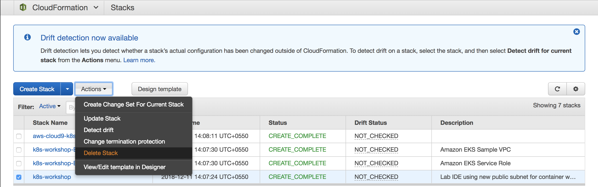

### Delete  woker nodes stack
```
aws cloudformation delete-stack --stack-name k8s-workshop-worker-nodes
```

### Delete Kube Cluser
```
aws eks delete-cluster --name k8s-workshop
```

### Delete CodeCommit and ECR Repo:
```
aws ecr delete-repository --repository-name eks-cicd-demo-repo --force --region us-west-2

aws codecommit delete-repository --repository-name eks-cicd-demo-repo --region us-west-2
```

### Delete Lambda kube client function
```
aws lambda delete-function --function-name LambdaKubeClient
```

### Delete Cloudformation stack k8-workshop by visting Cloudformation console.

