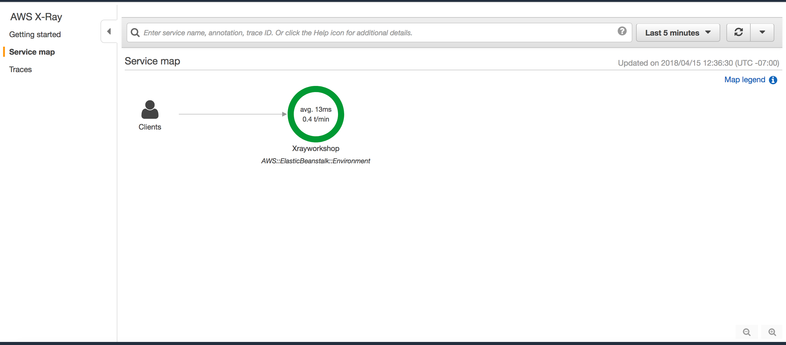
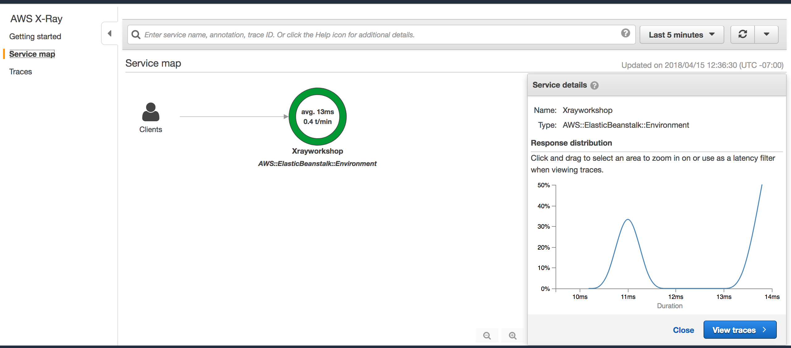
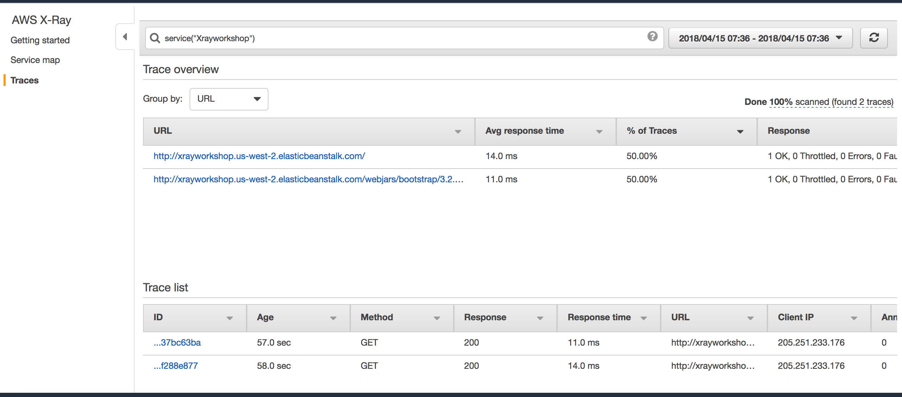
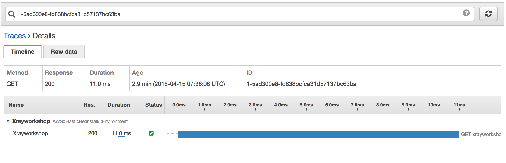

Enabling X-Ray for JSP Tomcat application


1. If you use Maven or Gradle to build your application, add the <a href=“https://docs.aws.amazon.com/xray/latest/devguide/xray-sdk-java.html#xray-sdk-java-dependencies”> X-Ray SDK for Java to your build configuration</a>.

2. For Tomcat, add a listener that extends ServletContextListener

```java
import com.amazonaws.xray.AWSXRay;
import com.amazonaws.xray.AWSXRayRecorderBuilder;
import com.amazonaws.xray.plugins.EC2Plugin;
import com.amazonaws.xray.strategy.sampling.LocalizedSamplingStrategy;

import java.net.URL;
import javax.servlet.ServletContextEvent;
import javax.servlet.ServletContextListener;

public class Startup implements ServletContextListener {

    @Override
    public void contextInitialized(ServletContextEvent event) {
        AWSXRayRecorderBuilder builder = AWSXRayRecorderBuilder.standard().withPlugin(new EC2Plugin());

        URL ruleFile = Startup.class.getResource("/sampling-rules.json");
        builder.withSamplingStrategy(new LocalizedSamplingStrategy(ruleFile));

        AWSXRay.setGlobalRecorder(builder.build());
    }

    @Override
    public void contextDestroyed(ServletContextEvent event) { }
}
```

Add in your WEB-INF/web.xml

```
<listener>
    <listener-class>com.amazonaws.labs.sampleapp.Startup</listener-class>
</listener>
```


3. Add <a href=“https://docs.aws.amazon.com/xray/latest/devguide/xray-sdk-java-filters.html#xray-sdk-java-filters-tomcat”> tracing filters </a> to your Tomcat application.

4. <a href="https://docs.aws.amazon.com/xray/latest/devguide/xray-services-beanstalk.html">Enable X-Ray daemon</a> in the AWS Elastic Beanstalk environment.

5. Deploy your Tomcat application to AWS Elastic Beanstalk

### X-Ray latency histogram


### X-Ray trace timeline


### X-Ray trace detailed

